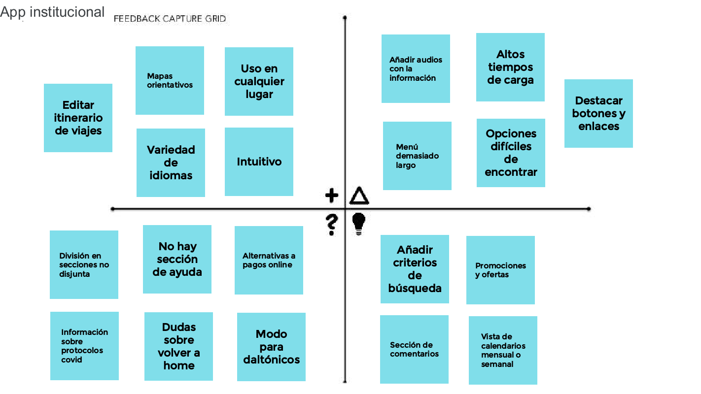
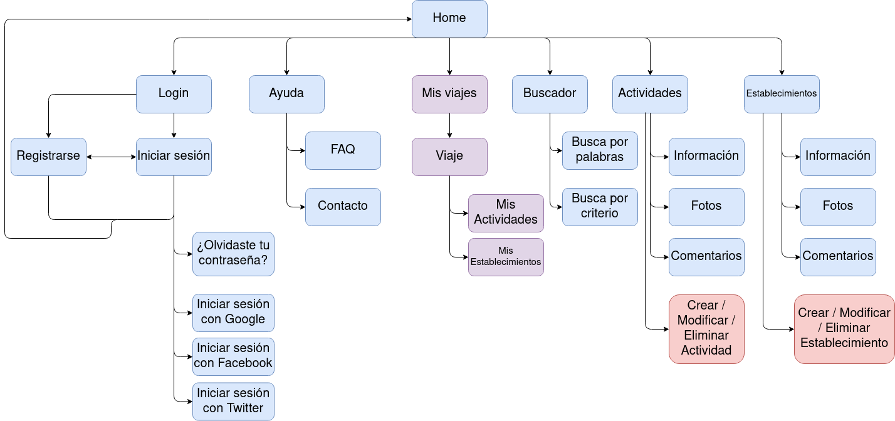
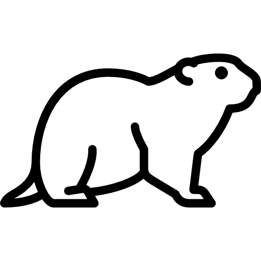

# DIU - Practica2, entregables

> Autores: Ana Buendía Ruiz-Azuaga y Juan Antonio Villegas Recio
>
> Grupo: Marmotas
>
> Repositorio: [DIU21](https://github.com/Mapachana/DIU21)

## Ideación

Hemos realizado una malla receptora de información basándonos en las experiencias de nuestros usuarios ficticios de la práctica 1. Para ello, nos hemos planteado qué sugerencias podrían tener los usuarios y cuáles tendrían los desarrolladores, aportando así nuestro propio enfoque del problema.

## Propuesta de valor

La aplicación móvil a desarrollar es una plataforma para consultar, organizar y planificar viajes. La plataforma pondrá a disposición del usuario información sobre actividades culturales, hoteles, lugares emblemáticos y monumentos, de forma que pueda realizarse fácilmente un itinerario completo del viaje de una manera sencilla e intuitiva.

## Task analysis

Una vez recogidas las propuestas de los usuarios y las nuestras propias, clasificamos las tareas principales de la plataforma y su grado de utilización según los distintos perfiles de los usuarios.

|        Funcionalidades        | Usuarios no registrados | Usuarios registrados | Agencias de viajes | Administrador |
| :---------------------------: | ----------------------- | -------------------- | ------------------ | ------------- |
|      Buscar actividades       | Alta                    | Alta                 | Alta               | Baja          |
|    Buscar establecimiento     | Alta                    | Alta                 | Alta               | Baja          |
|     Reservar actividades      | Baja                    | Alta                 | Alta               | Baja          |
|   Reservar establecimiento    | Baja                    | Alta                 | Alta               | Baja          |
|       Cancelar reserva        | Baja                    | Media                | Media              | Baja          |
|   Consultar disponibilidad    | Media                   | Alta                 | Alta               | Baja          |
|   Añadir actividad a viaje    | Baja                    | Alta                 | Alta               | Baja          |
|  Eliminar actividad de viaje  | Baja                    | Alta                 | Alta               | Baja          |
|    Exportar plan de viaje     | Baja                    | Media                | Alta               | Baja          |
|       Añadir comentario       | Baja                    | Media                | Baja               | Baja          |
|     Consultar comentarios     | Media                   | Alta                 | Baja               | Alta          |
|      Eliminar comentario      | Baja                    | Baja                 | Baja               | Media         |
| Contactar con la institución  | Baja                    | Baja                 | Media              | Baja          |
|        Consultar ayuda        | Media                   | Media                | Baja               | Baja          |
|          Registrarse          | Media                   | Baja                 | Baja               | Baja          |
|        Iniciar sesión         | Baja                    | Alta                 | Alta               | Baja          |
|         Cerrar sesión         | Baja                    | Alta                 | Alta               | Baja          |
|         Darse de baja         | Baja                    | Baja                 | Baja               | Baja          |
|        Cambiar idioma         | Media                   | Media                | Baja               | Baja          |
| Consultar mapa en tiempo real | Baja                    | Media                | Baja               | Baja          |
|    Añadir establecimiento     | Baja                    | Baja                 | Baja               | Alta          |
|   Eliminar establecimiento    | Baja                    | Baja                 | Baja               | Alta          |
|   Modificar establecimiento   | Baja                    | Baja                 | Baja               | Alta          |
|       Añadir actividad        | Baja                    | Baja                 | Baja               | Alta          |
|      Eliminar actividad       | Baja                    | Baja                 | Baja               | Alta          |
|      Modificar actividad      | Baja                    | Baja                 | Baja               | Alta          |
|        Banear cuentas         | Baja                    | Baja                 | Baja               | Media         |

### ## Arquitecturas de información

### Sitemap

Desarrollamos el mapa web de la aplicación, indicando en azul las páginas que puede usar cualquier usuario (no registrados, registrados y agencias de viajes), en morado las que solo pueden usar usuarios registrados y agencias de viajes y en rojo el administrador de la aplicación.

### Labelling

Explicamos la funcionalidad de cada icono y apartado de la página.

| Label             | Scope note                                                   | Icon                                                         |
| :---------------- | ------------------------------------------------------------ | ------------------------------------------------------------ |
| Home              | Página inicial de la aplicación                              |    |
| Menú              | Menú principal de la aplicación                              |         |
| Accesibilidad     | Indica si una actividad o establecimiento es accesible       |  |
| Imagen            | Representa una imagen                                        |      |
| Idioma            | Apartado para seleccionar el idioma                          |  |
| Mis viajes        | Apartado de los viajes creados del usuario                   |     |
| Contacto          | Apartado para contactar con mantenimiento                    |      |
| Registrarse/Login | Apartado para iniciar sesión o crearse una cuenta            |       |
| Logout            | Cerrar sesión actual                                         |      |
| Ayuda             | Apartado para consultas sobre el uso de la app               |  |
| Buscar            | Búsquedas en la aplicación                                   |       |
| Añadir            | Crear un nuevo viaje o añadir una actividad o evento a un viaje existente. |          |
| Twitter           | Botón para compartir o iniciar sesión con twitter.           |       |
| Instagram         | Botón para compartir en instagram.                           |    |
| Facebook          | Botón para compartir o iniciar sesión con facebook           |     |
| Google            | Iniciar sesión con google..                                  |       |
| Actividad         | Apartado de actividades.                                     |     |
| Establecimiento   | Apartado de establecimientos.                                |       |
| Comentarios       | Apartado de comentarios de una actividad                     |  |
| Editar            | Editar una actividad o evento.                               |  |
| Borrar            | Borrar un viaje, actividad o evento.                         |       |

## Prototipo Lo-FI Wireframe

Hemos realizado un boceto de la aplicación, que se puede consultar aquí.

### Conclusiones  
Hemos diseñado la aplicación intentando centrarnos en los aspectos más relevantes, como son los iconos usados para que resulten intuitivos al usuario y la distribución de las pantallas, de forma que no estén sobrecargadas en ningún momento.

También hemos tenido en cuenta para el diseño las necesidades de nuestras personas ficticias de la práctica 1, Jorge y Amparo, por lo que hemos procurado una letra clara con tamaño grande e intentado ofrecer información sobre la accesibilidad de cada actividad y establecimiento de forma rápida.