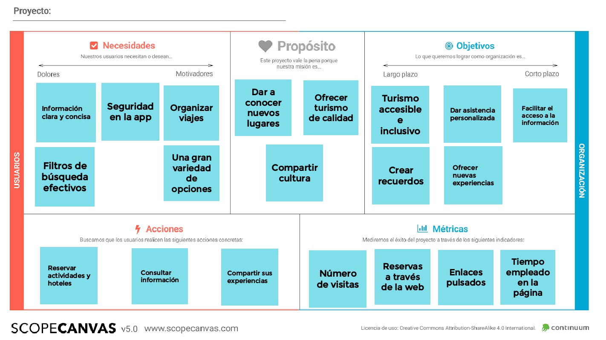

## DIU - Practica2, entregables

### Ideación 
* Malla receptora de información  <-
* Mapa de empatía
* Point of View 

### PROPUESTA DE VALOR

* ScopeCanvas

La aplicación móvil a desarrollar es una plataforma para consultar, organizar y planificar viajes. La plataforma pondrá a disposición del usuario información sobre actividades culturales, hoteles, lugares emblemáticos y monumentos, de forma que pueda realizarse fácilmente un itinerario completo del viaje de una manera sencilla e intuitiva.

### TASK ANALYSIS

* User Task Matrix 
* User/Task flow

|        Funcionalidades        | Usuarios no registrados | Usuarios registrados | Agencias de viajes | Administrador |
| :---------------------------: | ----------------------- | -------------------- | ------------------ | ------------- |
|      Buscar actividades       | Alta                    | Alta                 | Alta               | Baja          |
|    Buscar establecimiento     | Alta                    | Alta                 | Alta               | Baja          |
|     Reservar actividades      | Baja                    | Alta                 | Alta               | Baja          |
|   Reservar establecimiento    | Baja                    | Alta                 | Alta               | Baja          |
|       Cancelar reserva        | Baja                    | Media                | Media              | Baja          |
|   Consultar disponibilidad    | Media                   | Alta                 | Alta               | Baja          |
|   Añadir actividad a viaje    | Baja                    | Alta                 | Alta               | Baja          |
|  Eliminar actividad de viaje  | Baja                    | Alta                 | Alta               | Baja          |
|    Exportar plan de viaje     | Baja                    | Media                | Alta               | Baja          |
|       Añadir comentario       | Baja                    | Media                | Baja               | Baja          |
|     Consultar comentarios     | Media                   | Alta                 | Baja               | Alta          |
|      Eliminar comentario      | Baja                    | Baja                 | Baja               | Media         |
| Contactar con la institución  | Baja                    | Baja                 | Media              | Baja          |
|        Consultar ayuda        | Media                   | Media                | Baja               | Baja          |
|          Registrarse          | Media                   | Baja                 | Baja               | Baja          |
|        Iniciar sesión         | Baja                    | Alta                 | Alta               | Baja          |
|         Cerrar sesión         | Baja                    | Alta                 | Alta               | Baja          |
|         Darse de baja         | Baja                    | Baja                 | Baja               | Baja          |
|        Cambiar idioma         | Media                   | Media                | Baja               | Baja          |
| Consultar mapa en tiempo real | Baja                    | Media                | Baja               | Baja          |
|    Añadir establecimiento     | Baja                    | Baja                 | Baja               | Alta          |
|   Eliminar establecimiento    | Baja                    | Baja                 | Baja               | Alta          |
|   Modificar establecimiento   | Baja                    | Baja                 | Baja               | Alta          |
|       Añadir actividad        | Baja                    | Baja                 | Baja               | Alta          |
|      Eliminar actividad       | Baja                    | Baja                 | Baja               | Alta          |
|      Modificar actividad      | Baja                    | Baja                 | Baja               | Alta          |
|        Banear cuentas         | Baja                    | Baja                 | Baja               | Media         |

### ARQUITECTURA DE INFORMACIÓN

* Sitemap 
* Labelling 

SItemap:

### Labelling

| Label             | Scope note                                                   | Icon                                        |
| ----------------- | ------------------------------------------------------------ | ------------------------------------------- |
| Home              | Página inicial de la aplicación                              |                   |
| Menú              | Menú principal de la aplicación                              |                   |
| Cerrar            | Opción para cerrar el apartado actual                        |                  |
| Imagen            | Representa una imagen                                        |                |
| Idioma            | Apartado para seleccionar el idioma                          |            |
| Mis viajes        | Apartado de los viajes creados del usuario                   |                  |
| Contacto          | Apartado para contactar con mantenimiento                    |                |
| Registrarse/Login | Apartado para iniciar sesión o crearse una cuenta            |                 |
| Ayuda             | Apartado para consultas sobre el uso de la app               |            |
| Buscar            | Búsquedas en la aplicación                                   |                 |
| Añadir            | Añadir un nuevo viaje, actividad o evento.                   |                    |
| Twitter           | Botón para compartir en twitter.                             |                 |
| Instagram         | Botón para compartir en instagram.                           |              |
| Facebook          | Botón para compartir en facebook                             |               |
| Google            | Iniciar sesión con google                                    |                 |
| Confirmar         | Botón para indicar que se ha finalizado la acción y se desea guardar |  |
| Comentarios       | Apartado de comentarios de una actividad                     |          |
| Editar            | Editar un viaje, actividad o evento.                         |            |
| Borrar            | Borrar un viaje, actividad o evento.                         |                 |

### Prototipo Lo-FI Wireframe 

### Conclusiones  
(incluye valoración de esta etapa)
