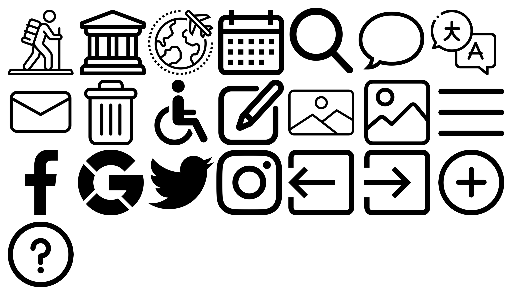

# DIU - Practica 3, entregables

> Autores: Ana Buendía Ruiz-Azuaga y Juan Antonio Villegas Recio
>
> Grupo: Marmotas
>
> Repositorio: [DIU21](https://github.com/Mapachana/DIU21)

## Moodboard (diseño visual + logotipo)   

Para comenzar hemos realizado un moodboard, usando imágenes que representan los lugares más emblemáticos, mosaicos y diversos paisajes de Granada. La paleta de colores está inspirada en los colores de la Alhambra y sus mosaicos, colores que hemos usado para la realización del logo, landingpage y aplicación.

Como fuentes hemos elegido `Lobster` para el logo y slogan y `Source Serif Pro` para el resto del texto. 

El logotipo ha sido diseñado usando [esta página](https://www.tailorbrands.com/es/logo-maker), buscando un diseño sencillo, claro y minimalista que sea representativo de nuestra ciudad, así como hemos hecho con los iconos de la aplicación.

## Landing Page

También hemos realizado una landingpage del proyecto, usando de nuevo la paletta de colores escogida anteriormente y las fuentes.

Hemos intentado primar la simplicidad del diseño optando por un esquema más visual, transmitiendo el mensaje mediante imágenes y manteniendo el texto al mínimo.

La landing page se puede consultar [aquí](https://github.com/Mapachana/DIU21/blob/master/P3/landingpage.pdf).

## Guidelines

Para decidir qué patrones debemos usar en nuestra aplicación, comenzamos analizando las distintas necesidades de los usuarios, qué esperan de nuestra aplicación (para lo cuál hemos recurrido de nuevo a las personas ficticias de la primera práctica) y qué soluciones a estos requisitos se ajustan mejor.

Tras un estudio de los diversos patrones disponibles en la web [ui-patterns.com](http://ui-patterns.com/patterns) los diversos patrones que consideramos en nuestro diseño fueron los a continuación listados:

* [**Calendar picker**](http://ui-patterns.com/patterns/CalendarPicker): Necesario a la hora de filtrar búsquedas según fechas, para poder elegir intervalos de tiempo o días consultando directamente un calendario. Este patrón nos resultará especialmente útil en el buscador de la aplicación.

* [**Input Feedbak**](http://ui-patterns.com/patterns/InputFeedback): Útil cuando un usuario introduce ciertos datos, permitiendo que compruebe por sí mismo y símbolos visuales que los datos introducidos son válidos. Lo usaremos tanto al registrarse como en el apartado de ayuda, que los usuarios pueden usar para contactar.

* [**Input Prompt**](http://ui-patterns.com/patterns/InputPrompt): Utilizado en el buscador para expresar claramente su funcionalidad. De nuevo, será encesario en el buscador y apartado de contacto para esclarecer la infomación que se requiere en cada apartado.

* [**Home Link**](http://ui-patterns.com/patterns/HomeLink): Utilizamos el logo de la aplicación como enlace directo y desde cualquier página a la página principal (Home). Este patrón afecta a toda la aplicación, haciendo siempre accesible el home de la aplicación en cualquier momento.

* [**Vertical Dropdown Menu**](http://ui-patterns.com/patterns/VerticalDropdownMenu): Principalmente utilizado en el menú lateral de la aplicación, accesible desde cualquier ubicación y desplegable, ahorrando espacio de pantalla.

* [**Event Calendar**](http://ui-patterns.com/patterns/EventCalendar): Es intuitivo a la hora de listar actividades con fechas concretas hacerlo siguiendo el orden cronológico que establecen.

* [**Categorization**](http://ui-patterns.com/patterns/categorization): Agrupamos en categorías limitadas y sin ambigüedad el contenido y las distintas posibilidades que ofrece Granada. En nuestro caso, hay dos claros ejemplos de clasificación: actividades y establecimientos.

* [**Continuous Scrolling**](http://ui-patterns.com/patterns/ContinuousScrolling): Las listas de actividades, establecimientos o las preguntas frecuentes (faq) se encuentran en una misma página que las lista, pudiendo acceder a todas ellas haciendo scroll en la página adecuada.

* [**Tagging**](http://ui-patterns.com/patterns/Tag): Las diversas actividades y establecimientos ofertados admiten etiquetas para simplificar las búsquedas según temas.

* [**Frequently Asked Questions (FAQ)**](http://ui-patterns.com/patterns/frequently-asked-questions-faq): Dedicamos una sección de la app a preguntas que suelen repetir los usuarios, de manera que los mismos tengan acceso rápido y sencillo a soluciones frecuentes, facilitando el uso de la aplicación a nuevos usuarios o personas con poco conocimiento en el campo de tecnologías, así como evitamos una saturación del contacto.

* [**Gallery**](http://ui-patterns.com/patterns/Gallery): Utilizamos amplias galerías de imágenes en cada actividad y establecimiento para mostrar los mismos a los diversos usuarios.

* [**Live Filter**](http://ui-patterns.com/patterns/LiveFilter): En el buscador utilizamos varios filtros de distintos tipo para que el usuario haga la búsqueda que más se ajuste a sus necesidades.

* [**Lazy Registration**](http://ui-patterns.com/patterns/LazyRegistration): Permitimos que cualquier usuario que acceda a la app pueda navegar sin ningún problema sin necesidad de registrarse.

## Mockup: LAYOUT HI-FI

Basándonos en los wireframe que diseñamos en la práctica anterior y utilizando las fuentes, paleta de colores, y logo que hemos creado y estudiado anteriormente, recogemos nuestra propuesta de bocetos Hi-Fi (mockup) en [este doscumento](https://github.com/Mapachana/DIU21/blob/master/P3/mockup.pdf) .

Este mockup se ha diseñado con Figma y puede consultarse [aquí](https://www.figma.com/file/MLUxVUx6N19gKJSYwIf8Nu/wireframe?node-id=0%3A1), donde puede probarse la simulación del mismo.

## Documentación: Publicación del Case Study

### Inspiración

VisitaGranada surge como iniciativa para ofrecer a los usuarios una aplicación oficial con toda la información sobre todas las actividades, visitas y establecimientos que pueden encontrarse en Granada de forma clara, intuitiva y accesible para todos los usuarios.

Primeramente, vemos las experiencias de Amparo y Jorge, dos personas muy diferentes que tuvieron problemas al reservar un viaje a Granada por us circunstancias con las distintas páginas de turismo habituales. Observamos que Amparo tenía dificultades para navegar debido a la complejidad de muchas web ante sus dificultades con las nuevas tecnologías, derivadas de su edad y del hecho de que estaba empezando a perder la vista. Por otro lado, Jorge estaba acostumbrado al uso y manejo de internet y redes, pero sufría de una discapacidad, Jorge era sordo, y siempre intentaba buscar actividades accesibles para él. Sin embargo, la mayoría de las web no ofrecían gran detalle sobre el turismo accesible. Además, su presupuesto era limitado, y muchas páginas no permiten filtrar por precios

### Primeros pasos

Gracias a las vivencias de estas dos personas, y también a las nuestras propias, recogimos una serie de ideas y objetivos mediante la malla receptora de información y el Scope Canvas que posteriormente se reflejarían en nuestro propio diseño. Pensamos que los usuarios más probables eran los propios posibles clientes, registrados o sin registrar, agencias de viajes que buscasen actividades que hacer y lugares que visitar y usuarios administradores que se encargaran del mantenimiento de la app. Así, ordenamos las funcionalidades que requería cada tipo de usuario según prioridad.

Con estas premisas creamos nuestros primeros bocetos de aplicación: los 'wireframe', que eran una primera versión muy simplificada de las ideas que en las siguientes fases formalizariamos, el esqueleto de nuestra aplicación, que pueden verse [aquí](https://github.com/Mapachana/DIU21/blob/master/P2/wireframe.pdf).

### Desarrollo de los diseños

Una vez asentada la idea, pensada la funcionalidad y diseñada la estructura de nuestra aplicación, tocaba darle vida al proyecto. Para empezar, creamos un moodboard que recogiera todo lo que queríamos reflejar en el diseño de nuestra página: imágenes, colores representativos, un logo, fuentes que utilizaríamos. Así, dotamos de identidad a VisitaGranada.

Diseñamos una landing page que llamara la atención de los posibles usuarios tratando de hacerla simple y atractiva, dándole una gran importancia a la componente visual de la misma y reforzando las ventajas de usar nuestra aplicación.

La landing page se puede consultar [aquí](https://github.com/Mapachana/DIU21/blob/master/P3/landingpage.pdf).

Finalmente, analizamos patrones de diseño que se ajustaran a las necesidades de los usuarios y retomamos los diseños que creamos anteriormente para dotarlos de la identidad de la aplicación. 

La apariencia final de la aplicación se ve [aquí](https://github.com/Mapachana/DIU21/blob/master/P3/mockup.pdf).

### Conclusión

Inspirandonos en experiencias de personas ficticias, pudimos desarrollar el diseño completo de una aplicación centrándonos en las necesidades de los usuarios a la par que aprendíamos técnicas de branding para hacer nuestra aplicación atractiva. Así, hemos obtenido una aplicación intuitiva y sencilla que cubre las necesidades básicas de sus usuarios.
