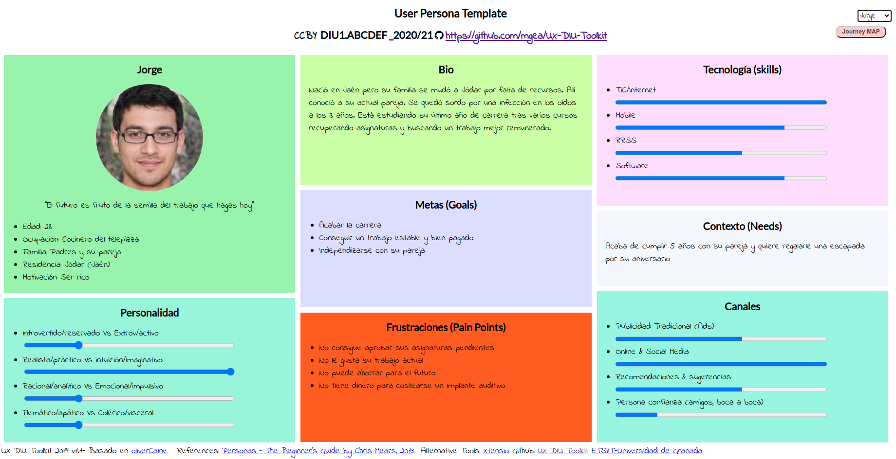
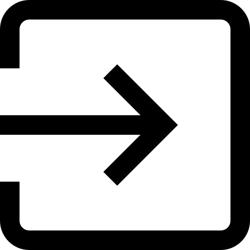

# DIU21
Prácticas Diseño Interfaces de Usuario 2020-21 (Tema: Turismo) 

Grupo: DIU2_Marmotas.  Curso: 2020/21 
Updated: 18/4/2021

Proyecto: 
>>> MarmotaGranada

Descripción: 

>>> Aplicación oficial del Ayuntamiento de Granada para planificar viajes y obtener información sobre actividades y estalbecimientos en la ciudad de manera sencilla y accesible en cualquier momento.
De esta forma todo el mundo podrá visitar Granada de forma segura y compartir sus experiencias con los demás. 

Logotipo: 
>>> Opcionalmente si diseña un logotipo para su producto en la práctica 3 pongalo aqui

Miembros
 * :bust_in_silhouette:   Ana Buendía Ruiz-Azuaga 🦝  
 * :bust_in_silhouette:   Juan Antonio Villegas Recio 🐂

# Proceso de Diseño 

## Paso 1. UX Desk Research & Analisis 

 1.a Competitive Analysis
-----

Nuestra página a estudiar es [turgranada.es](https://www.turgranada.es/ ), una página de información turística sobre la ciudad de Granada. Ha sido esta nuestra elección debido a que tras examinar varias alternativas, pensamos que es la opción más completa e intuitiva.

Otras opciones de página web donde informarse es [granadadirect.com](http://www.granadadirect.com/info-practica/oficinas-turismo-granada/) que cuenta con un apartado de opiniones donde el usuario puede consultar las impresiones de otros turistas y dejar la suya propia. También tiene unas secciones específicas destacadas de la Alhambra, el Generalife y alrededores con enlaces directos para la compra de entradas y organización de visitas guiadas a los mismos, destacándolos así como los mayores atractivos turísticos de la ciudad. Sin embargo, no dispone de un buscador, lo que dificulta la planificación del viaje.

También hemos observado [turismo.gal](https://www.turismo.gal/axenda-cultural?langId=es_ES), web sobre turismo en Galicia, donde lo primero a resaltar es que la página no dispone de una traducción al inglés, lo cuál puede ser un problema. Dispone de varios buscadores según distintos criterios y un calendario donde comprobar eventos próximos. Asimismo su información está muy completa con diversos enlaces y recursos, siendo muy intuitiva a la hora de navegar por ella. Finalmente, dispone de redes sociales activas para compartir diversas zonas de interés turístico.

Igualmente [granadatur.com](http://www.granadatur.com/) cuenta con un apartado en el que añadir los planes para planificar tu viaje y luego poder descargarlo cómodamente, además tiene enlaces a sus redes sociales donde anuncian eventos próximos que pueden interesar. Muchos de los enlaces de la página no funcionan.

Finalmente, [es.madrid.com/donde-dormir](https://www.esmadrid.com/donde-dormir) dispone de un apartado para planificar el viaje durante la pandemia indicando qué hoteles y otros servicios de la comunidad están abiertos y sus medidas sanitarias. Cuenta con diversos enlaces a servicios para facilitar el uso de estos. 

Para terminar, todas las páginas tienen versión web disponible también para móviles, de forma que pueden consultarse en cualquier momento.

### 

 1.b Persona
-----

En primer lugar hemos creado a Amparo, una señora mayor con poco conocimiento sobre el uso de las tecnologías, lo que le dificulta organizar un viaje por internet.

Asimismo tenemos a Jorge, cuya principal dificultad para llevar a cabo la tarea de organizar un viaje es su falta de presupuesto y la dificultad de encontrar actividades adaptadas para él.

 1.c User Journey Map
----

Las experiencias de Amparo y Jorge son bastante distintas, pero creemos que son situaciones que se dan con frecuencia.

Para comenzar, Amparo pide ayuda a su hija, que le muestra una página web donde conseguir información para organizar el viaje online, pero Amparo prefiere realizar las reservas por teléfono.

La experiencia de Jorge es muy distinta, pues él no tiene problema en buscar la información y realizar las reservas solo, pero no encuentra nada sobre visitas guiadas que pueda realizar con su discapacidad ni le es fácil realizar búsquedas de alojamiento y actividades de acuerdo a su presupuesto.

 1.d Usability Review
----
[**Enlace al documento con la Revison de usabilidad**](./P1/Usability-review-template.pdf)

**Valoración final: 76 - Good**

En general la página cumple con la mayor parte de funcionalidades y requisitos que el usuario espera de ella, si bien habría que mejorar las búsquedas para que tengan más posibles criterios, añadir una página de ayuda, hacer más claras las acciones a realizar sobre las actividades y esclarecer para qué colectivos son accesibles las distintas actividades disponibles.

## Paso 2. UX Design  

 2.a Feedback Capture Grid / EMpathy map / POV
----

Hemos realizado una malla receptora de información basándonos en las experiencias de nuestros usuarios ficticios de la práctica 1. Para ello, nos hemos planteado qué sugerencias podrían tener los usuarios y cuáles tendrían los desarrolladores, aportando así nuestro propio enfoque del problema.

 2.b ScopeCanvas
----
La aplicación móvil a desarrollar es una plataforma para consultar, organizar y planificar viajes. La plataforma pondrá a disposición del usuario información sobre actividades culturales, hoteles, lugares emblemáticos y monumentos, de forma que pueda realizarse fácilmente un itinerario completo del viaje de una manera sencilla e intuitiva.

 2.b Tasks analysis 
-----

Una vez recogidas las propuestas de los usuarios y las nuestras propias, clasificamos las tareas principales de la plataforma y su grado de utilización según los distintos perfiles de los usuarios.

|        Funcionalidades        | Usuarios no registrados | Usuarios registrados | Agencias de viajes | Administrador |
| :---------------------------: | ----------------------- | -------------------- | ------------------ | ------------- |
|      Buscar actividades       | Alta                    | Alta                 | Alta               | Baja          |
|    Buscar establecimiento     | Alta                    | Alta                 | Alta               | Baja          |
|     Reservar actividades      | Baja                    | Alta                 | Alta               | Baja          |
|   Reservar establecimiento    | Baja                    | Alta                 | Alta               | Baja          |
|       Cancelar reserva        | Baja                    | Media                | Media              | Baja          |
|   Consultar disponibilidad    | Media                   | Alta                 | Alta               | Baja          |
|   Añadir actividad a viaje    | Baja                    | Alta                 | Alta               | Baja          |
|  Eliminar actividad de viaje  | Baja                    | Alta                 | Alta               | Baja          |
|    Exportar plan de viaje     | Baja                    | Media                | Alta               | Baja          |
|       Añadir comentario       | Baja                    | Media                | Baja               | Baja          |
|     Consultar comentarios     | Media                   | Alta                 | Baja               | Alta          |
|      Eliminar comentario      | Baja                    | Baja                 | Baja               | Media         |
| Contactar con la institución  | Baja                    | Baja                 | Media              | Baja          |
|        Consultar ayuda        | Media                   | Media                | Baja               | Baja          |
|          Registrarse          | Media                   | Baja                 | Baja               | Baja          |
|        Iniciar sesión         | Baja                    | Alta                 | Alta               | Baja          |
|         Cerrar sesión         | Baja                    | Alta                 | Alta               | Baja          |
|         Darse de baja         | Baja                    | Baja                 | Baja               | Baja          |
|        Cambiar idioma         | Media                   | Media                | Baja               | Baja          |
| Consultar mapa en tiempo real | Baja                    | Media                | Baja               | Baja          |
|    Añadir establecimiento     | Baja                    | Baja                 | Baja               | Alta          |
|   Eliminar establecimiento    | Baja                    | Baja                 | Baja               | Alta          |
|   Modificar establecimiento   | Baja                    | Baja                 | Baja               | Alta          |
|       Añadir actividad        | Baja                    | Baja                 | Baja               | Alta          |
|      Eliminar actividad       | Baja                    | Baja                 | Baja               | Alta          |
|      Modificar actividad      | Baja                    | Baja                 | Baja               | Alta          |
|        Banear cuentas         | Baja                    | Baja                 | Baja               | Media         |

 2.c IA: Sitemap + Labelling 
----

Desarrollamos el mapa web de la aplicación, indicando en azul las páginas que puede usar cualquier usuario (no registrados, registrados y agencias de viajes), en morado las que solo pueden usar usuarios registrados y agencias de viajes y en rojo el administrador de la aplicación.

### Labelling

Explicamos la funcionalidad de cada icono y apartado de la página.

| Label             | Scope note                                                   | Icon                                                         |
| :---------------- | ------------------------------------------------------------ | ------------------------------------------------------------ |
| Home              | Página inicial de la aplicación                              |    |
| Menú              | Menú principal de la aplicación                              |         |
| Accesibilidad     | Indica si una actividad o establecimiento es accesible       |  |
| Imagen            | Representa una imagen                                        |      |
| Idioma            | Apartado para seleccionar el idioma                          |  |
| Mis viajes        | Apartado de los viajes creados del usuario                   |     |
| Contacto          | Apartado para contactar con mantenimiento                    |      |
| Registrarse/Login | Apartado para iniciar sesión o crearse una cuenta            |       |
| Logout            | Cerrar sesión actual                                         |      |
| Ayuda             | Apartado para consultas sobre el uso de la app               |  |
| Buscar            | Búsquedas en la aplicación                                   |       |
| Añadir            | Crear un nuevo viaje o añadir una actividad o evento a un viaje existente. |          |
| Twitter           | Botón para compartir o iniciar sesión con twitter.           |       |
| Instagram         | Botón para compartir en instagram.                           |    |
| Facebook          | Botón para compartir o iniciar sesión con facebook           |     |
| Google            | Iniciar sesión con google..                                  |       |
| Actividad         | Apartado de actividades.                                     |     |
| Establecimiento   | Apartado de establecimientos.                                |       |
| Comentarios       | Apartado de comentarios de una actividad                     |  |
| Editar            | Editar una actividad o evento.                               |  |
| Borrar            | Borrar un viaje, actividad o evento.                         |       |

 2.d Wireframes
-----

Hemos realizado un boceto de la aplicación, que se puede consultar [aquí](./P2/wireframe.pdf).

## Paso 3. Mi UX-Case Study (diseño)

 3.a Moodboard
-----

>>> Plantear Diseño visual con una guía de estilos visual (moodboard) 
>>> Incluir Logotipo
>>> Si diseña un logotipo, explique la herramienta utilizada y la resolución empleada. ¿Puede usar esta imagen como cabecera de Twitter, por ejemplo, o necesita otra?

  3.b Landing Page
----

>>> Plantear Landing Page 

 3.c Guidelines
----

>>> Estudio de Guidelines y Patrones IU a usar 
>>> Tras documentarse, muestre las deciones tomadas sobre Patrones IU a usar para la fase siguiente de prototipado. 

  3.d Mockup
----

>>> Layout: Mockup / prototipo HTML  (que permita simular tareas con estilo de IU seleccionado)

 3.e ¬øMy UX-Case Study?
-----

>>> Publicar my Case Study en Github..
>>> Documente y resuma el diseño de su producto en forma de video de 90 segundos aprox

## Paso 4. Evaluación 

 4.a Caso asignado
----

>>> Breve descripción del caso asignado con enlace a  su repositorio Github

 4.b User Testing
----

>>> Seleccione 4 personas ficticias. Exprese las ideas de posibles situaciones conflictivas de esa persona en las propuestas evaluadas. Asigne dos a Caso A y 2 al caso B

| Usuarios | Sexo/Edad     | Ocupación   |  Exp.TIC    | Personalidad | Plataforma | TestA/B
| ------------- | -------- | ----------- | ----------- | -----------  | ---------- | ----
| User1's name  | H / 18   | Estudiante  | Media       | Introvertido | Web.       | A 
| User2's name  | H / 18   | Estudiante  | Media       | Timido       | Web        | A 
| User3's name  | M / 35   | Abogado     | Baja        | Emocional    | móvil      | B 
| User4's name  | H / 18   | Estudiante  | Media       | Racional     | Web        | B 

. 4.c Cuestionario SUS
----

>>> Usaremos el **Cuestionario SUS** para valorar la satisfacción de cada usuario con el diseño (A/B) realizado. Para ello usamos la [hoja de cálculo](https://github.com/mgea/DIU19/blob/master/Cuestionario%20SUS%20DIU.xlsx) para calcular resultados sigiendo las pautas para usar la escala SUS e interpretar los resultados
http://usabilitygeek.com/how-to-use-the-system-usability-scale-sus-to-evaluate-the-usability-of-your-website/)
Para más información, consultar aquí sobre la [metodología SUS](https://cui.unige.ch/isi/icle-wiki/_media/ipm:test-suschapt.pdf)

>>> Adjuntar captura de imagen con los resultados + Valoración personal 

 4.d Usability Report
----

>> Añadir report de usabilidad para práctica B (la de los compañeros)

>>> Valoración personal 

## Paso 5. Evaluación de Accesibilidad  

  5.a Accesibility evaluation Report 
----

>>> Indica qué pretendes evaluar (de accesibilidad) sobre qué APP y qué resultados has obtenido 

>>> 5.a) Evaluación de la Accesibilidad (con simuladores o verificación de WACG) 
>>> 5.b) Uso de simuladores de accesibilidad 

>>> (uso de tabla de datos, indicar herramientas usadas) 

>>> 5.c Breve resumen del estudio de accesibilidad (de práctica 1) y puntos fuertes y de mejora de los criterios de accesibilidad de tu diseño propuesto en Práctica 4.

## Conclusión final / Valoración de las prácticas

>>> (90-150 palabras) Opinión del proceso de desarrollo de diseño siguiendo metodología UX y valoración (positiva /negativa) de los resultados obtenidos  

