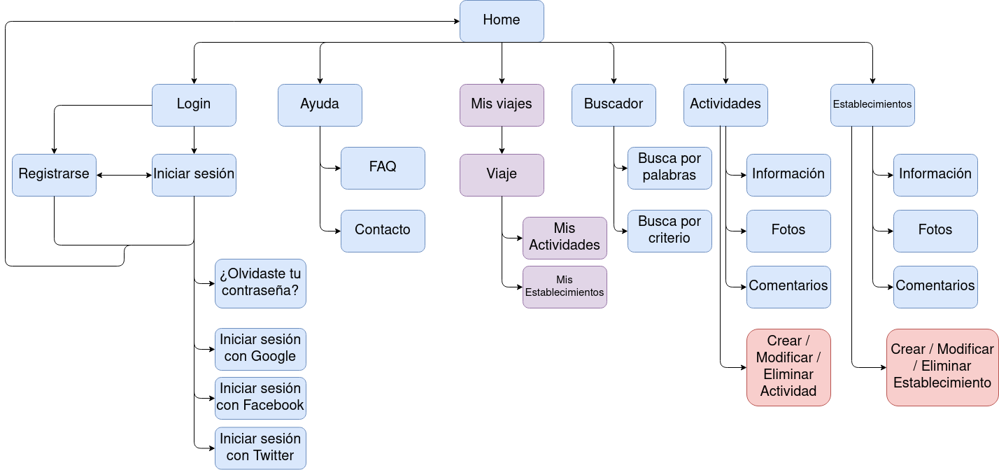
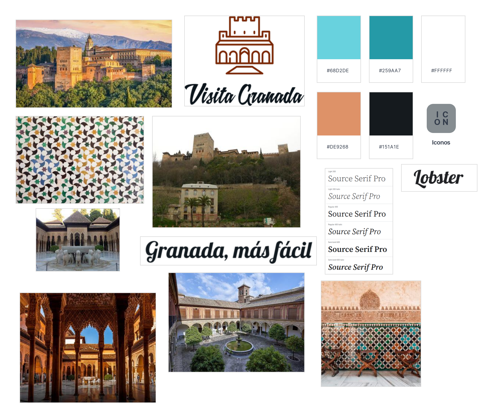

# DIU21
Prácticas Diseño Interfaces de Usuario 2020-21 (Tema: Turismo) 

Grupo: DIU2_Marmotas.  Curso: 2020/21 
Updated: 18/4/2021

Proyecto: 
>>> VisitaGranada

Descripción: 

>>> Aplicación oficial del Ayuntamiento de Granada para planificar viajes y obtener información sobre actividades y estalbecimientos en la ciudad de manera sencilla y accesible en cualquier momento.
De esta forma todo el mundo podrá visitar Granada de forma segura y compartir sus experiencias con los demás. 

Logotipo: 
>>> 

Miembros
 * :bust_in_silhouette:   Ana Buendía Ruiz-Azuaga 🦝  
 * :bust_in_silhouette:   Juan Antonio Villegas Recio 🐂

# Proceso de Diseño 

## Paso 1. UX Desk Research & Analisis 

 1.a Competitive Analysis
-----

Nuestra página a estudiar es [turgranada.es](https://www.turgranada.es/ ), una página de información turística sobre la ciudad de Granada. Ha sido esta nuestra elección debido a que tras examinar varias alternativas, pensamos que es la opción más completa e intuitiva.

Otras opciones de página web donde informarse es [granadadirect.com](http://www.granadadirect.com/info-practica/oficinas-turismo-granada/) que cuenta con un apartado de opiniones donde el usuario puede consultar las impresiones de otros turistas y dejar la suya propia. También tiene unas secciones específicas destacadas de la Alhambra, el Generalife y alrededores con enlaces directos para la compra de entradas y organización de visitas guiadas a los mismos, destacándolos así como los mayores atractivos turísticos de la ciudad. Sin embargo, no dispone de un buscador, lo que dificulta la planificación del viaje.

También hemos observado [turismo.gal](https://www.turismo.gal/axenda-cultural?langId=es_ES), web sobre turismo en Galicia, donde lo primero a resaltar es que la página no dispone de una traducción al inglés, lo cuál puede ser un problema. Dispone de varios buscadores según distintos criterios y un calendario donde comprobar eventos próximos. Asimismo su información está muy completa con diversos enlaces y recursos, siendo muy intuitiva a la hora de navegar por ella. Finalmente, dispone de redes sociales activas para compartir diversas zonas de interés turístico.

Igualmente [granadatur.com](http://www.granadatur.com/) cuenta con un apartado en el que añadir los planes para planificar tu viaje y luego poder descargarlo cómodamente, además tiene enlaces a sus redes sociales donde anuncian eventos próximos que pueden interesar. Muchos de los enlaces de la página no funcionan.

Finalmente, [es.madrid.com/donde-dormir](https://www.esmadrid.com/donde-dormir) dispone de un apartado para planificar el viaje durante la pandemia indicando qué hoteles y otros servicios de la comunidad están abiertos y sus medidas sanitarias. Cuenta con diversos enlaces a servicios para facilitar el uso de estos. 

Para terminar, todas las páginas tienen versión web disponible también para móviles, de forma que pueden consultarse en cualquier momento.

### 

 1.b Persona
-----

En primer lugar hemos creado a Amparo, una señora mayor con poco conocimiento sobre el uso de las tecnologías, lo que le dificulta organizar un viaje por internet.

Asimismo tenemos a Jorge, cuya principal dificultad para llevar a cabo la tarea de organizar un viaje es su falta de presupuesto y la dificultad de encontrar actividades adaptadas para él.

 1.c User Journey Map
----

Las experiencias de Amparo y Jorge son bastante distintas, pero creemos que son situaciones que se dan con frecuencia.

Para comenzar, Amparo pide ayuda a su hija, que le muestra una página web donde conseguir información para organizar el viaje online, pero Amparo prefiere realizar las reservas por teléfono.

La experiencia de Jorge es muy distinta, pues él no tiene problema en buscar la información y realizar las reservas solo, pero no encuentra nada sobre visitas guiadas que pueda realizar con su discapacidad ni le es fácil realizar búsquedas de alojamiento y actividades de acuerdo a su presupuesto.

 1.d Usability Review
----
[**Enlace al documento con la Revison de usabilidad**](./P1/Usability-review-template.pdf)

**Valoración final: 76 - Good**

En general la página cumple con la mayor parte de funcionalidades y requisitos que el usuario espera de ella, si bien habría que mejorar las búsquedas para que tengan más posibles criterios, añadir una página de ayuda, hacer más claras las acciones a realizar sobre las actividades y esclarecer para qué colectivos son accesibles las distintas actividades disponibles.

## Paso 2. UX Design  

 2.a Feedback Capture Grid
----

Hemos realizado una malla receptora de información basándonos en las experiencias de nuestros usuarios ficticios de la práctica 1. Para ello, nos hemos planteado qué sugerencias podrían tener los usuarios y cuáles tendrían los desarrolladores, aportando así nuestro propio enfoque del problema.

 2.b ScopeCanvas
----
La aplicación móvil a desarrollar es una plataforma para consultar, organizar y planificar viajes. La plataforma pondrá a disposición del usuario información sobre actividades culturales, hoteles, lugares emblemáticos y monumentos, de forma que pueda realizarse fácilmente un itinerario completo del viaje de una manera sencilla e intuitiva.

 2.b Tasks analysis 
-----

Una vez recogidas las propuestas de los usuarios y las nuestras propias, clasificamos las tareas principales de la plataforma y su grado de utilización según los distintos perfiles de los usuarios.

|        Funcionalidades        | Usuarios no registrados | Usuarios registrados | Agencias de viajes | Administrador |
| :---------------------------: | ----------------------- | -------------------- | ------------------ | ------------- |
|      Buscar actividades       | Alta                    | Alta                 | Alta               | Baja          |
|    Buscar establecimiento     | Alta                    | Alta                 | Alta               | Baja          |
|     Reservar actividades      | Baja                    | Alta                 | Alta               | Baja          |
|   Reservar establecimiento    | Baja                    | Alta                 | Alta               | Baja          |
|       Cancelar reserva        | Baja                    | Media                | Media              | Baja          |
|   Consultar disponibilidad    | Media                   | Alta                 | Alta               | Baja          |
|   Añadir actividad a viaje    | Baja                    | Alta                 | Alta               | Baja          |
|  Eliminar actividad de viaje  | Baja                    | Alta                 | Alta               | Baja          |
|    Exportar plan de viaje     | Baja                    | Media                | Alta               | Baja          |
|       Añadir comentario       | Baja                    | Media                | Baja               | Baja          |
|     Consultar comentarios     | Media                   | Alta                 | Baja               | Alta          |
|      Eliminar comentario      | Baja                    | Baja                 | Baja               | Media         |
| Contactar con la institución  | Baja                    | Baja                 | Media              | Baja          |
|        Consultar ayuda        | Media                   | Media                | Baja               | Baja          |
|          Registrarse          | Media                   | Baja                 | Baja               | Baja          |
|        Iniciar sesión         | Baja                    | Alta                 | Alta               | Baja          |
|         Cerrar sesión         | Baja                    | Alta                 | Alta               | Baja          |
|         Darse de baja         | Baja                    | Baja                 | Baja               | Baja          |
|        Cambiar idioma         | Media                   | Media                | Baja               | Baja          |
| Consultar mapa en tiempo real | Baja                    | Media                | Baja               | Baja          |
|    Añadir establecimiento     | Baja                    | Baja                 | Baja               | Alta          |
|   Eliminar establecimiento    | Baja                    | Baja                 | Baja               | Alta          |
|   Modificar establecimiento   | Baja                    | Baja                 | Baja               | Alta          |
|       Añadir actividad        | Baja                    | Baja                 | Baja               | Alta          |
|      Eliminar actividad       | Baja                    | Baja                 | Baja               | Alta          |
|      Modificar actividad      | Baja                    | Baja                 | Baja               | Alta          |
|        Banear cuentas         | Baja                    | Baja                 | Baja               | Media         |

 2.c IA: Sitemap + Labelling 
----

Desarrollamos el mapa web de la aplicación, indicando en azul las páginas que puede usar cualquier usuario (no registrados, registrados y agencias de viajes), en morado las que solo pueden usar usuarios registrados y agencias de viajes y en rojo el administrador de la aplicación.

### Labelling

Explicamos la funcionalidad de cada icono y apartado de la página.

| Label             | Scope note                                                   | Icon                                                         |
| :---------------- | ------------------------------------------------------------ | ------------------------------------------------------------ |
| Home              | Página inicial de la aplicación                              |    |
| Menú              | Menú principal de la aplicación                              |         |
| Accesibilidad     | Indica si una actividad o establecimiento es accesible       |  |
| Imagen            | Representa una imagen                                        |      |
| Idioma            | Apartado para seleccionar el idioma                          |  |
| Mis viajes        | Apartado de los viajes creados del usuario                   |     |
| Contacto          | Apartado para contactar con mantenimiento                    |      |
| Registrarse/Login | Apartado para iniciar sesión o crearse una cuenta            |       |
| Logout            | Cerrar sesión actual                                         |      |
| Ayuda             | Apartado para consultas sobre el uso de la app               |  |
| Buscar            | Búsquedas en la aplicación                                   |       |
| Añadir            | Crear un nuevo viaje o añadir una actividad o evento a un viaje existente. |          |
| Twitter           | Botón para compartir o iniciar sesión con twitter.           |       |
| Instagram         | Botón para compartir en instagram.                           |    |
| Facebook          | Botón para compartir o iniciar sesión con facebook           |     |
| Google            | Iniciar sesión con google..                                  |       |
| Actividad         | Apartado de actividades.                                     |     |
| Establecimiento   | Apartado de establecimientos.                                |       |
| Comentarios       | Apartado de comentarios de una actividad                     |  |
| Editar            | Editar una actividad o evento.                               |  |
| Borrar            | Borrar un viaje, actividad o evento.                         |       |

 2.d Wireframes
-----

Hemos realizado un boceto de la aplicación, que se puede consultar [aquí](./P2/wireframe.pdf).

## Paso 3. Mi UX-Case Study (diseño)

 3.a Moodboard
-----

En nuestro [moodboard](https://app.milanote.com/1LDCs11jw1Z9bR/prctica-diu?p=Nh201TNrs4N) se puede contemplar que hemos recurrido a colores que recuerdan a la ciudad de Granada, a los mosaicos de la conocida Alhambra y a sus paisajes, sensaciones que hemos querido reflejar mediante las imágenes utilizadas. Respecto a las fuentes, hemos elegido *Lobster* para títulos principales y nuestro eslogan: '*Granada, más fácil*'. Junto a esta, utilizamos *Source Serif Pro* en sus diversas formas. Sobre el logotipo, ha sido diseñado utilizando la herramienta ("Insert herramienta"), buscando un diseño sencillo, claro y minimalista que al mismo tiempo sea representativo de nuestra ciudad. 

  3.b Landing Page
----

Presentamos el diseño de nuestra 'Landing Page' en el siguiente [enlace](./P3/Landingpage.pdf).

 3.c Guidelines
----

Tras un estudio de los diversos patrones disponibles en la web [ui-patterns.com](http://ui-patterns.com/patterns) los diversos patrones que consideramos en nuestro diseño fueron los a continuación listados:

### Forms

* [**Calendar picker**](http://ui-patterns.com/patterns/CalendarPicker): Necesario a la hora de filtrar búsquedas según fechas, para poder elegir intervalos de tiempo o días consultando directamente un calendario. 

* [**Input Feedbak**](http://ui-patterns.com/patterns/InputFeedback): Útil cuando un usuario introduce ciertos datos, permitiendo que compruebe por sí mismo y símbolos visuales que los datos introducidos son válidos.

* [**Input Prompt**](http://ui-patterns.com/patterns/InputPrompt): Utilizado en el buscador para expresar claramente su funcionalidad.

### Jumping in hierarchy

* [**Home Link**](http://ui-patterns.com/patterns/HomeLink): Utilizamos el logo de la aplicación como enlace directo y desde cualquier página a la página principal (Home).

### Menu

* [**Vertical Dropdown Menu**](http://ui-patterns.com/patterns/VerticalDropdownMenu): Principalmente utilizado en el menú lateral de la aplicación, accesible desde cualquier ubicación y desplegable, ahorrando espacio de pantalla.

### Content

* [**Event Calendar**](http://ui-patterns.com/patterns/EventCalendar): Es intuitivo a la hora de listar actividades con fechas concretas hacerlo siguiendo el orden cronológico que establecen.

* [**Categorization**](http://ui-patterns.com/patterns/categorization): Agrupamos en categorías limitadas y sin ambigüedad el contenido y las distintas posibilidades que ofrece Granada.

* [**Continuous Scrolling**](http://ui-patterns.com/patterns/ContinuousScrolling): Las listas de actividades, establecimientos o las preguntas frecuentes (faq) se encuentran en una misma página que las lista, pudiendo acceder a todas ellas haciendo scroll en la página adecuada.

* [**Tagging**](http://ui-patterns.com/patterns/Tag): Las diversas actividades y establecimientos ofertados admiten etiquetas que ayudan a localizarlos.

### Formatting data

* [**Frequently Asked Questions (FAQ)**](http://ui-patterns.com/patterns/frequently-asked-questions-faq): Dedicamos una sección de la app a preguntas que suelen repetir los usuarios, pudiendo así evitar muchas confusiones.

### Gallery

* [**Gallery**](http://ui-patterns.com/patterns/Gallery): Utilizamos amplias galerías de imágenes en cada actividad y establecimiento para así hacer propuestas visuales a los posibles clientes.

### Search

* [**Live Filter**](http://ui-patterns.com/patterns/LiveFilter): En el buscador utilizamos varios filtros de distinto tipo para que el usuario haga la búsqueda que más se ajuste a sus necesidades.

### Registration

* [**Lazy Registration**](http://ui-patterns.com/patterns/LazyRegistration): Permitimos que cualquier usuario que acceda a la app pueda navegar sin ningún problema antes de registrarse, la cual sí sería necesaria en caso de querer interactuar.

  3.d Mockup
----

Basándonos en los 'wireframe' que diseñamos en la práctica 2 y utilizando las fuentes, colores, logo... que hemos creado y estudiado anteriormente, recogemos nuestra propuesta de bocetos Hi-Fi (mockup) en [este documento](./P3/mockup.pdf) .

 3.e 쯄y UX-Case Study?
-----

### Inspiración

Durante el desarrollo de la primera práctica, creamos y nos pusimos en el lugar de Amparo y Jorge, dos personas muy diferentes pero con ciertas necesidades que no les permitían organizar un viaje a Granada de forma sencilla con las distintas páginas de turismo habituales. Observamos que Amparo tenía dificultades para navegar debido a la complejidad de muchas web ante sus dificultades con las nuevas tecnologías, derivadas de su edad y del hecho de que estaba empezando a perder la vista. Por otro lado, Jorge estaba acostumbrado al uso y manejo de internet y redes, pero sufría de una discapacidad, Jorge era sordo, y siempre intentaba buscar actividades accesibles para él. Sin embargo, la mayoría de las web no ofrecían gran detalle sobre el turismo accesible. Además, su presupuesto era limitado, pero la información sobre precios era también muy escasa.

Estudiando las experiencias de estas dos personas, decidimos solucionar sus problemas mediante nuestro propio diseño de app: **VisitaGranada**.

### Primeros pasos

Gracias a las vivencias de estas dos personas, y también a las nuestras propias, recogimos una serie de ideas y objetivos mediante la 'Feedback Capture Grid' y el 'Scope Canvas' que posteriormente se reflejarían en nuestro propio diseño. Pensamos que los usuarios más probables eran los propios posibles clientes, registrados o sin registrar, agencias de viajes que buscasen actividades que hacer y lugares que visitar y usuarios administradores que se encargaran del mantenimiento de la app.

Con estas premisas creamos nuestros primeros bocetos de aplicación: los 'wireframe', que eran una primera versión muy simplificada de las ideas que en las siguientes fases formalizariamos, el esqueleto de nuestra aplicación.

### Desarrollo de los diseños

Una vez asentada la idea, pensada la funcionalidad y diseñada la estructura de nuestra aplicación, tocaba darle vida al proyecto. Para empezar, creamos un moodboard que recogiera todo lo que queríamos reflejar en el diseño de nuestra página: imágenes, colores representativos, un logo, fuentes que utilizaríamos... 

Ya con esas decisiones tomadas, que aún no sabíamos que no eran definitivas, diseñamos una 'landing page' que llamara la atención de los posibles usuarios que llegaran a ella. En el encabezado, una imagen principal de la Alhambra de Granada, monumento mundialmente conocido, junto con el nombre de nuestro sitio y la posibilidad de descargar la app. Si de un primer vistazo el usuario no se convenció, expusimos algunas de las funcionalidades que propone nuestra app, acompañadas de imágenes sugerentes que llamarían la atención de cualquier turista. Por último, a modo de pie de página, de nuevo un enlace de descarga y links a nuestras redes sociales. La 'landing page', como no podía ser de otra forma, se diseñó cuidadosamente y siguiendo las normas que nosotros mismos nos marcamos al crear el moodboard.

Una vez creada la landing page y con las ideas asimiladas, buscamos posibles patrones de diseño de interfaces de usuario que se ajustaran a nuestras ideas, diseños y funcionalidades. Realizamos una exhaustiva búsqueda en la web [ui-patterns.com](http://ui-patterns.com/patterns), comparando patrones entre sí y buscando cuáles se podrían ajustar más y mejor a nuestra propuesta.

Ya con todos los ingredientes necesarios, retomamos los diseños que creamos anteriormente (wireframe) para darles un nuevo formato de acuerdo con la nueva apariencia. Utilizamos 'layout grid' para ajustar el tamaño de cada elemento de cada página diseñada, cambiamos las fuentes simples de los 'wireframe' por las que propusimos en el 'moodboard', ajustamos los colores a nuestra paleta, y dimos en general un aspecto amigable, sencillo, intuitivo, y sin olvidar las necesidades que vimos en nuestras personas ficticias.

### Conclusión

Inspirandonos en experiencias ficticias de personas ficticias, pudimos desarrollar el diseño completo de una aplicación. Desde la simple inspiración a la finalización del diseño, hemos aprendido las numerosas técnicas recurrentes para crear diseños intuitivos y útiles.

## Paso 4. Evaluación 

 4.a Caso asignado
----

>>> Breve descripción del caso asignado con enlace a  su repositorio Github

 4.b User Testing
----

>>> Seleccione 4 personas ficticias. Exprese las ideas de posibles situaciones conflictivas de esa persona en las propuestas evaluadas. Asigne dos a Caso A y 2 al caso B

| Usuarios | Sexo/Edad     | Ocupación   |  Exp.TIC    | Personalidad | Plataforma | TestA/B
| ------------- | -------- | ----------- | ----------- | -----------  | ---------- | ----
| User1's name  | H / 18   | Estudiante  | Media       | Introvertido | Web.       | A 
| User2's name  | H / 18   | Estudiante  | Media       | Timido       | Web        | A 
| User3's name  | M / 35   | Abogado     | Baja        | Emocional    |맔칩vil      | B 
| User4's name  | H / 18   | Estudiante  | Media       | Racional     | Web        | B 

. 4.c Cuestionario SUS
----

>>> Usaremos el **Cuestionario SUS** para valorar la satisfacción de cada usuario con el diseño (A/B) realizado. Para ello usamos la [hoja de cálculo](https://github.com/mgea/DIU19/blob/master/Cuestionario%20SUS%20DIU.xlsx) para calcular resultados sigiendo las pautas para usar la escala SUS e interpretar los resultados
http://usabilitygeek.com/how-to-use-the-system-usability-scale-sus-to-evaluate-the-usability-of-your-website/)
Para más información, consultar aquí sobre la [metodología SUS](https://cui.unige.ch/isi/icle-wiki/_media/ipm:test-suschapt.pdf)

>>> Adjuntar captura de imagen con los resultados + Valoración personal 

 4.d Usability Report
----

>> Añadir report de usabilidad para práctica B (la de los compañeros)

>>> Valoración personal 

## Paso 5. Evaluación de Accesibilidad  

  5.a Accesibility evaluation Report 
----

>>> Indica qué pretendes evaluar (de accesibilidad) sobre qué APP y qué resultados has obtenido 

>>> 5.a) Evaluación de la Accesibilidad (con simuladores o verificación de WACG) 
>>> 5.b) Uso de simuladores de accesibilidad 

>>> (uso de tabla de datos, indicar herramientas usadas) 

>>> 5.c Breve resumen del estudio de accesibilidad (de práctica 1) y puntos fuertes y de mejora de los criterios de accesibilidad de tu diseño propuesto en Práctica 4.

## Conclusión final / Valoración de las prácticas

>>> (90-150 palabras) Opinión del proceso de desarrollo de diseño siguiendo metodología UX y valoración (positiva /negativa) de los resultados obtenidos  

